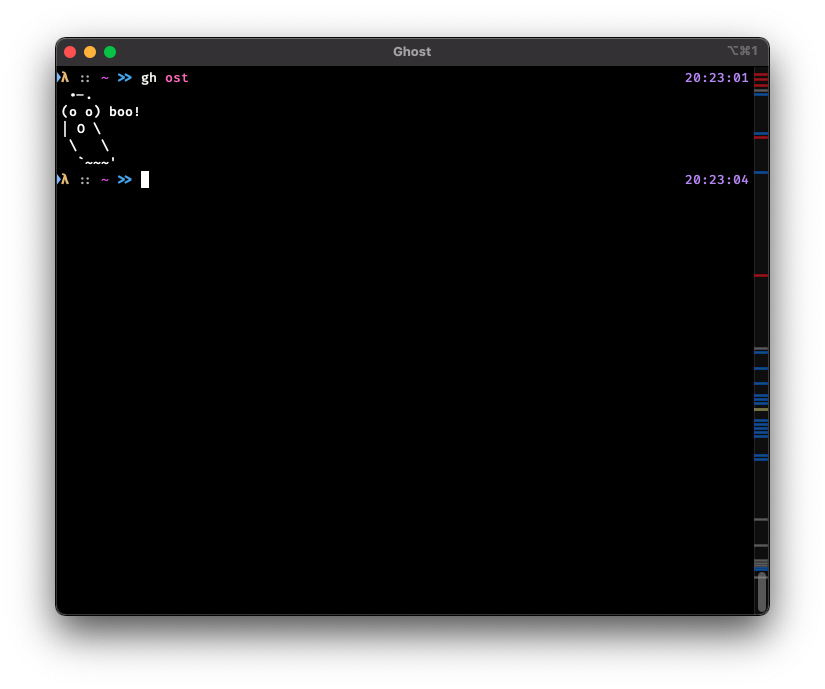

# gh ost

A [gh](https://github.com/cli/cli) extension to meet ghost.

## Usage

```sh
gh ost
```

## Installation

```sh
gh extension install mattn/gh-ost
```

## Screenshot



## License

MIT

## Author

Yasuhiro Matsumoto (a.k.a. mattn)
